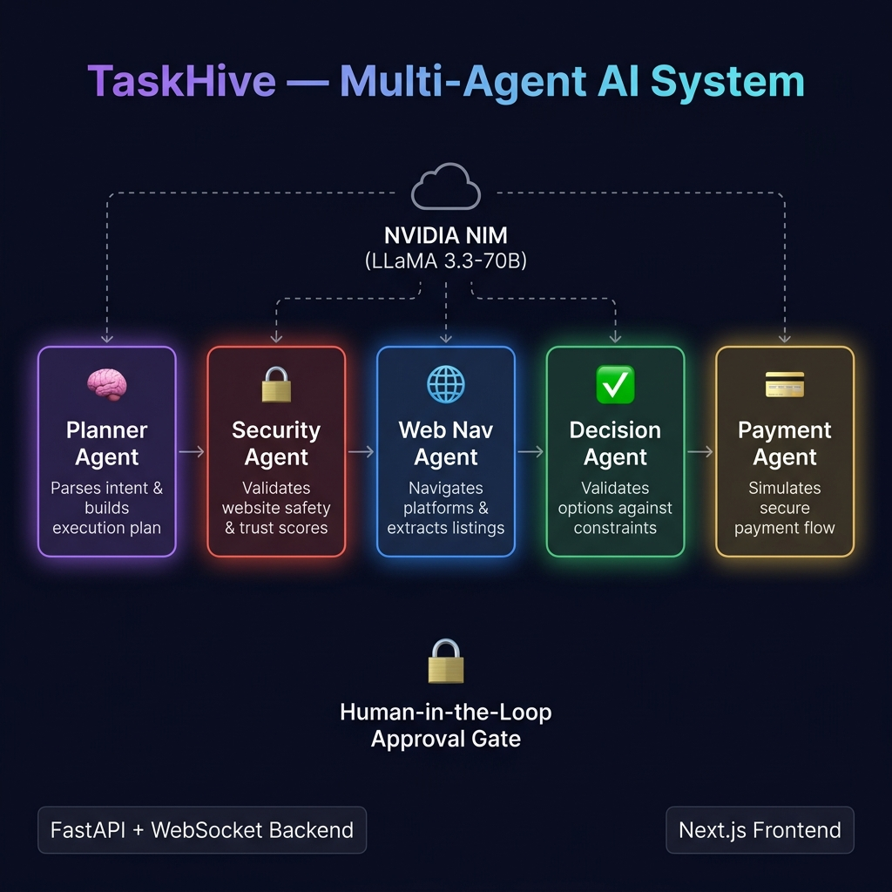

<div align="center">



# 🐝 TaskHive — Multi-Agent AI Booking System

**Five specialized AI agents collaborate autonomously to book tickets, pay bills, order food, and complete web tasks — with a built-in security layer and human-in-the-loop approval.**

[](https://python.org)
[](https://fastapi.tiangolo.com)
[](https://nextjs.org)
[](https://build.nvidia.com)
[](https://developer.mozilla.org/en-US/docs/Web/API/WebSockets_API)
[](./LICENSE)

[Live Demo](#running-locally) · [Architecture](#architecture) · [Agent Pipeline](#the-5-agent-pipeline) · [Setup](#getting-started)

</div>

---

## 🚀 What is TaskHive?

TaskHive is a **production-grade multi-agent AI system** where a swarm of five specialized agents work in sequence to complete complex real-world tasks — entirely autonomously. You describe a task in plain English, and the agent swarm handles everything: planning, security validation, web navigation, decision-making, and payment.

> **"Book 2 tickets for Avengers Endgame on Saturday evening under ₹800"**
> → 5 AI agents activate → 9-step execution plan → security scan → seat selection → approval modal → booking confirmed ✅

The system is powered by **NVIDIA NIM** (LLaMA 3.3-70B) with full function-calling support and exponential-backoff rate-limit resilience. When the NIM API is unavailable, every phase falls back to local Python tools — ensuring **zero crashes, always a result**.

---

## ✨ Key Features

| Feature | Details |
|---|---|
| 🤖 **5 Specialized Agents** | Planner, Security, Web Nav, Decision, Payment — each with a distinct role |
| 🔒 **Security-First Design** | Every website is scanned with multi-layer trust scoring before any action |
| 🧠 **LLM-Powered Reasoning** | NVIDIA NIM (LLaMA 3.3-70B) with native function-calling / tool-use |
| ⚡ **Real-time WebSocket Stream** | Live agent logs streamed to UI — watch agents think in real time |
| 🛡️ **Human-in-the-Loop** | Payment requires explicit user approval — no blind automation |
| 🔄 **Graceful 429 Fallback** | Rate-limit safe — every phase has a local fallback, pipeline never crashes |
| 🎬 **Multi-Category Tasks** | Movies, bills, food delivery, flights, hotels — fully context-aware |
| 🎲 **Realistic Simulation** | 21 cinemas, dynamic pricing ₹200–₹400, varied formats (IMAX/4DX/Dolby) |

---

## 🏗️ Architecture

```
User Input (Natural Language)
         │
         ▼
┌─────────────────────────────────────────────────────────────┐
│                    NVIDIA NIM (LLaMA 3.3-70B)                │
│              https://integrate.api.nvidia.com/v1             │
└──────┬──────────┬──────────┬──────────┬──────────┬──────────┘
       │          │          │          │          │
  ┌────▼────┐ ┌───▼────┐ ┌──▼─────┐ ┌──▼─────┐ ┌──▼─────┐
  │ Planner │ │Security│ │Web Nav │ │Decision│ │Payment │
  │  Agent  │ │ Agent  │ │ Agent  │ │ Agent  │ │ Agent  │
  └────┬────┘ └───┬────┘ └──┬─────┘ └──┬─────┘ └──┬─────┘
       │          │          │          │          │
       └──────────┴──────────┴──────────┴──────────┘
                             │
                    ┌────────▼────────┐
                    │  FastAPI Server  │
                    │  + WebSocket     │
                    └────────┬────────┘
                             │
                    ┌────────▼────────┐
                    │  Next.js 15 UI  │
                    │  (Real-time log) │
                    └─────────────────┘
```

### Project Structure

```
Multi-Agent System/
│
├── agents/                    # The 5 specialized AI agents
│   ├── orchestrator.py        # Master pipeline — coordinates all agents
│   ├── nim_client.py          # NVIDIA NIM API client with retry logic
│   ├── planner_agent.py       # Intent parsing & task planning
│   ├── security_agent.py      # URL safety & trust scoring
│   ├── web_nav_agent.py       # Web navigation & data extraction
│   ├── decision_agent.py      # Constraint validation & best-option selection
│   └── payment_agent.py       # Payment simulation & receipt generation
│
├── tools/                     # Agent tool implementations
│   ├── web_tools.py           # Movie listings, seat selection, form filling
│   ├── security_tools.py      # URL safety checks, domain reputation
│   ├── payment_tools.py       # Payment processing, booking refs
│   └── task_tools.py          # Intent parsing, task planning utilities
│
├── api/
│   └── server.py              # FastAPI server + WebSocket event streaming
│
├── frontend/                  # Next.js 15 dashboard
│   └── src/
│       ├── app/page.tsx        # Main dashboard with real-time agent log
│       └── components/
│           ├── AgentPanel.tsx  # 5 agent status cards
│           ├── AgentLog.tsx    # Live event stream log
│           ├── SecurityBadge.tsx  # Trust score display
│           └── ApprovalModal.tsx  # Human approval gate
│
├── tests/                     # Test suite (11 integration tests)
├── .env.example               # Environment variable template
└── requirements.txt           # Python dependencies
```

---

## 🤖 The 5-Agent Pipeline

### 1. 🧠 Planner Agent
Parses the user's natural language input to extract **intent, category, quantity, budget, date/time preferences**, and builds a structured 9-step execution plan. Detects task type: `movies`, `bills`, `food`, `flights`, `hotels`.

### 2. 🔒 Security Agent
Runs **multi-layer trust validation** on every website before use:
- HTTPS verification
- Domain reputation scoring
- Typosquatting / lookalike detection
- Phishing keyword analysis
- Community trust database lookup

Sites are scanned based on task category — `paytm.com` for bills, `zomato.com` for food, `bookmyshow.com` for movies, etc.

### 3. 🌐 Web Nav Agent
Simulates **browser navigation** to the security-cleared platform:
- Extracts live movie/product listings with dynamic pricing
- Filters options by budget, date, and time constraints
- Selects the best-value option from 21+ supported venues
- Handles seat selection and booking form filling

### 4. ✅ Decision Agent
Validates the selected option against all user constraints:
- Budget compliance check
- Date/time preference matching
- Seat availability verification
- Generates a formatted **Booking Summary** for human review

### 5. 💳 Payment Agent
After human approval, simulates the full payment flow:
- Routes to appropriate payment gateway (UPI/Card/Netbanking)
- Calculates breakdown: base price + convenience fee + 18% GST
- Generates a unique booking reference code
- Sends simulated confirmation receipt

---

## 🛡️ Rate-Limit Resilience

TaskHive uses NVIDIA NIM's free tier which has rate limits (~5 req/min). Every phase handles this gracefully:

```
NIM API call → 429 Rate Limit?
                     │
         ┌─────No────┴────Yes──────┐
         │                         │
    Use NIM result            Local fallback
    (full AI reasoning)       (Python tools)
         │                         │
         └──────────┬──────────────┘
                    │
             Continue pipeline
             (never crashes)
```

---

## 🚀 Getting Started

### Prerequisites
- Python 3.13+
- Node.js 18+
- NVIDIA NIM API key (free at [build.nvidia.com](https://build.nvidia.com))

### 1. Clone the repository

```bash
git clone https://github.com/iyogyasharma-09/Multi-Ai-Booking-Agent.git
cd Multi-Ai-Booking-Agent
```

### 2. Set up Python environment

```bash
python3 -m venv .venv
source .venv/bin/activate          # Windows: .venv\Scripts\activate
pip install -r requirements.txt
```

### 3. Configure environment variables

```bash
cp .env.example .env
# Edit .env and add your NVIDIA NIM API key:
# NVIDIA_API_KEY=nvapi-xxxxxxxxxxxxxxxxxxxx
```

### 4. Start the backend

```bash
uvicorn api.server:app --port 8000 --reload
```

### 5. Start the frontend

```bash
cd frontend
npm install
npm run dev
```

### 6. Open the app

Visit **[http://localhost:3000](http://localhost:3000)** and try:

- `"Book 2 tickets for Avengers Endgame on Saturday evening under ₹800"`
- `"Pay my Airtel broadband bill of ₹999"`
- `"Order 2 Margherita pizzas from Zomato under ₹600"`
- `"Book a PVR Gold ticket for Oppenheimer on Sunday night"`

---

## 🔧 Tech Stack

| Layer | Technology |
|---|---|
| **AI / LLM** | NVIDIA NIM · LLaMA 3.3-70B Instruct (via OpenAI-compatible API) |
| **Agent Orchestration** | Custom Python orchestrator with asyncio |
| **Backend** | FastAPI · Uvicorn · WebSocket (real-time streaming) |
| **Frontend** | Next.js 15 · TypeScript · Vanilla CSS |
| **Communication** | WebSocket + REST (FastAPI ↔ Next.js) |
| **Rate Limiting** | Exponential backoff · Per-phase local fallbacks |

---

## 📊 Example Task Flow

```
User: "Book 2 tickets for Deadpool on Friday evening under ₹900"

11:18:57  ORCHESTRATOR  🚀 Task registered — ID: BC142A7E
11:18:57  PLANNER       🧠 Analysing task and creating execution plan...
11:19:12  PLANNER       ✅ Plan created — category: movies, qty: 2, budget: ₹900
11:19:14  SECURITY      🔒 Running security validation on target websites...
11:19:18  SECURITY      ✅ bookmyshow.com: trust=100/100 · SAFE
                        ✅ pvrinemas.com: trust=100/100 · SAFE
11:19:20  WEB NAV       🌐 Navigating platforms and extracting listings...
11:19:25  WEB NAV       ✅ Found 3 shows — Best: Cinepolis Forum Mall | Fri 7:30 PM | ₹290/seat
11:19:27  DECISION      ✅ Validating selection against constraints...
11:19:30  DECISION      📋 Total: ₹648 · Within ₹900 budget ✅ · Awaiting approval...
          ───────── HUMAN APPROVAL GATE ─────────
11:19:35  PAYMENT       💳 Processing UPI payment of ₹648...
11:19:37  PAYMENT       🎉 Booking Confirmed! Ref: BMS-2026-K8X3PQ
```

---

## 🧪 Running Tests

```bash
# Activate virtual environment first
source .venv/bin/activate

# Run all 11 integration tests
python -m pytest tests/ -v

# Test NIM connectivity specifically
python tests/test_nim_integration.py
```

---

## 📝 Environment Variables

| Variable | Required | Description |
|---|---|---|
| `NVIDIA_API_KEY` | ✅ Yes | Your NVIDIA NIM API key from build.nvidia.com |
| `NIM_MODEL` | Optional | Override model (default: `meta/llama-3.3-70b-instruct`) |
| `ALLOWED_ORIGINS` | Optional | CORS origins for frontend (default: `http://localhost:3000`) |

---

## 🤝 Contributing

Contributions are welcome! Please feel free to submit a Pull Request.

1. Fork the repository
2. Create your feature branch (`git checkout -b feature/AmazingFeature`)
3. Commit your changes (`git commit -m 'Add some AmazingFeature'`)
4. Push to the branch (`git push origin feature/AmazingFeature`)
5. Open a Pull Request

---

## 📄 License

This project is licensed under the MIT License — see the [LICENSE](LICENSE) file for details.

---

## 👨‍💻 Author

**Yogya Sharma**

- GitHub: [@iyogyasharma-09](https://github.com/iyogyasharma-09)

---

<div align="center">

**⭐ Star this repo if you found it useful!**

Built with ❤️ using NVIDIA NIM · FastAPI · Next.js

</div>
